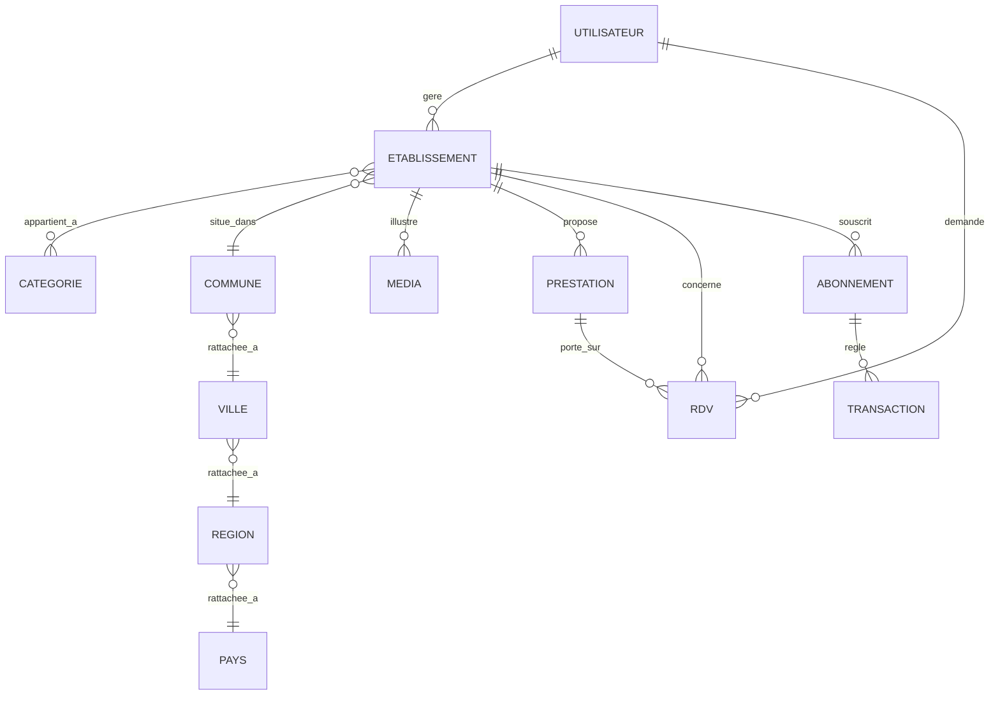

# MCD — Modèle Conceptuel des Données

## Entités et propriétés principales

- **UTILISATEUR** (id_utilisateur, telephone, nom, type_compte, date_creation)
- **ETABLISSEMENT** (id_etablissement, nom_etablissement, description, gps_latitude, gps_longitude,
  horaires, numero_service_client, statut_kyc, url_piece_identite, url_photo_devanture)
- **CATEGORIE** (id_categorie, libelle_categorie)
- **COMMUNE** (id_commune, libelle_commune) — rattachée à VILLE > REGION > PAYS
- **VILLE** (id_ville, libelle_ville)
- **REGION** (id_region, libelle_region)
- **PAYS** (id_pays, libelle_pays)
- **MEDIA** (id_media, type_media, url, ordre_affichage)
- **PRESTATION** (id_prestation, libelle_prestation, tarif, duree_minutes)
- **RDV** (id_rdv, date_heure_debut, statut_rdv, date_creation)
- **ABONNEMENT** (id_abonnement, periodicite, date_debut_engagement, montant, statut_abonnement)
- **TRANSACTION** (id_transaction, canal_paiement, statut_transaction, date_transaction, montant)

## Associations et cardinalités

| Association | Entité A | Cardinalité A | Entité B | Cardinalité B |
|---|---|---|---|---|
| GERE | UTILISATEUR (partenaire) | 1,1 | ETABLISSEMENT | 1,N |
| APPARTIENT_A | ETABLISSEMENT | 1,N | CATEGORIE | 1,N |
| SITUE_DANS | ETABLISSEMENT | 1,1 | COMMUNE | 0,N |
| RATTACHEE_A (Commune→Ville) | COMMUNE | 1,1 | VILLE | 0,N |
| RATTACHEE_A (Ville→Région) | VILLE | 1,1 | REGION | 0,N |
| RATTACHEE_A (Région→Pays) | REGION | 1,1 | PAYS | 0,N |
| ILLUSTRE | ETABLISSEMENT | 1,1 | MEDIA | 0,N |
| PROPOSE | ETABLISSEMENT | 1,1 | PRESTATION | 0,N |
| DEMANDE | UTILISATEUR (client) | 1,1 | RDV | 0,N |
| CONCERNE | RDV | 1,1 | ETABLISSEMENT | 0,N |
| PORTE_SUR | RDV | 0,N | PRESTATION | 1,1 |
| SOUSCRIT | ETABLISSEMENT | 1,1 | ABONNEMENT | 0,N |
| REGLE | ABONNEMENT | 1,1 | TRANSACTION | 0,N |

## Diagramme (notation Mermaid ER)

Règles de gestion associées : RG-ID-04 (unicité téléphone), RG-LOC-01 (hiérarchie géo),
RG-CAT-01 (catégorie obligatoire), RG-ETB-02 (au moins une prestation), RG-RDV-02/05 (créneaux).
